# Movie Reviews

Movie Reviews is a responsive website on a various number of devices that targets people who feel like reading or review movies &/or interact with other users of the site.
 

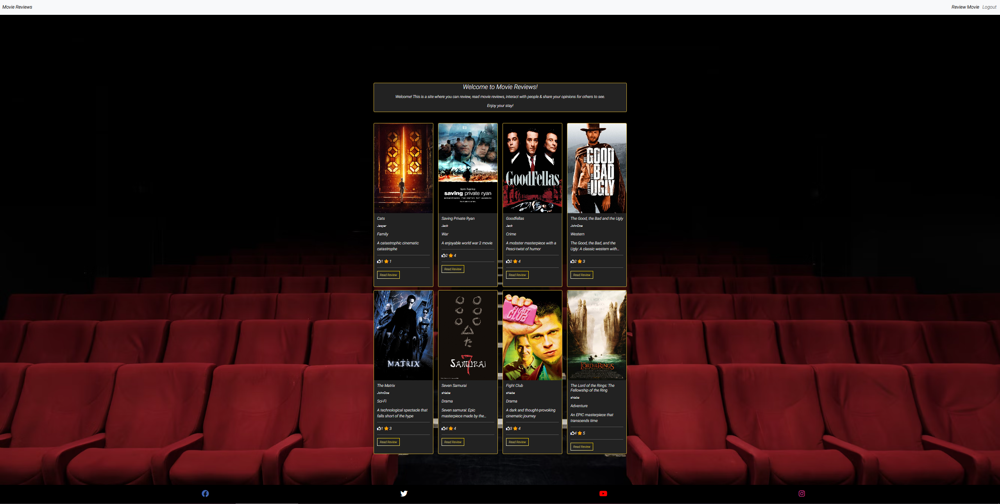

[You can view this site here](https://shiaba-movie-reviews-ef013a07675f.herokuapp.com/)

## Contents

### [Features](#features-1)

- [Features yet to add](#features-yet-to-add)
- [Wireframes](#wireframes)

### [User Experience](#user-experience-1) 
- [Agile](#agile)
- [User stories](#user-stories)
- [User Expectations](#user-expectations)

### [Technologies Used](#technologies-used-1)
- [Libraries, Frameworks & Programming Languasges Used](#libraries-frameworks--programming-languasges-used)

### [Testing](#testing-1)
  - [Manual testing](#manual-testing)
  - [Validator testing](#validator-testing)
  - [Accessibility](#accessibility)

### [Bug Encounters](#bug-encounters-1)
  - [Solved](#solved)
  - [Unsolved and scrapped features](#unsolved-and-scrapped-features)

### [Deployment](#deployment-1)

### [Credits](#credits-1)

# Features
### Welcoming page
 - This section welcomes users to the site & gives a small information of what users can do.
 

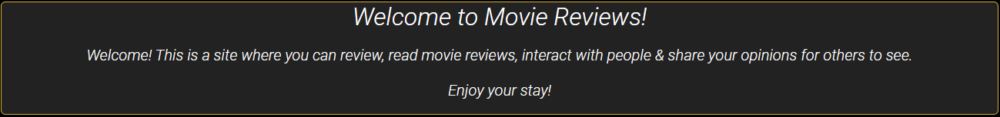

### Navbar
- The navigation bar is fully reponsive on all screen sizes.
- Clicking on any of the locations on the navbar will lead the user to that specific location.
- If user is not logged in or has an account, they will only only get specific locations to navigate through. The same is for logged in users (image 3 & 4).
- Logged in users will not see sign up or log in options when already logged in & also get two new options instead.

 

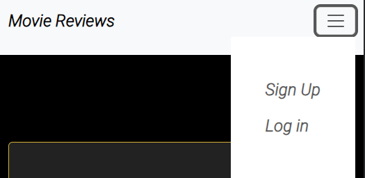

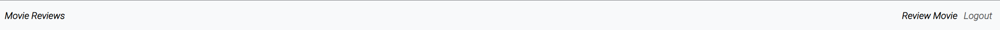

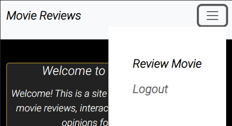

### Footer
 - The footer remains responsive on all screen sizes
 - If user clicks on icon, it will open a new tab & lead them to intended location.  
 

### Create Review
 - Only logged in users can create reviews.
 - If something is not typed in corrctly, user will get a warning instruction, where they can type it in correctly.
 - When done, they can submit the review through the button at the bottom.
 

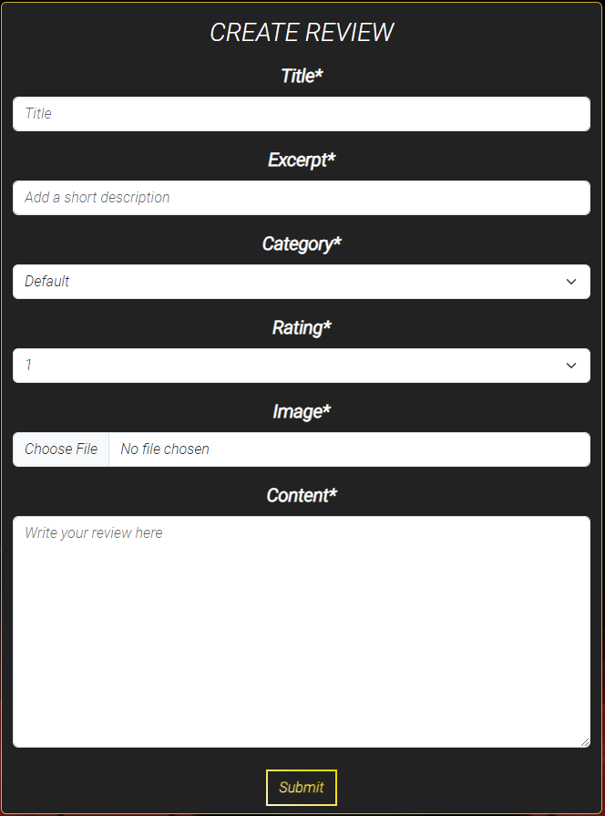

### Sign Up
 - The form enables the user to create an account.
 - Email is optional & not required.
 - If the user already has an account, they can press the "Log in here!" link to be lead to the login page.
 - An alert that the user has signed in will be displayed on the screen.
 

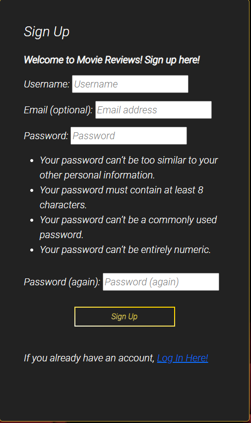

### Login
 - The form enables the user to log in to their account.
 - Logging in will give the user the oppertunity to create reviews, comment & like reviews, as well as edit/delete their own reviews if they wish to. 
 - If the user doesn't have an account, they can press the "Sign up here!" link to be lead to the Sign up page.
 - An alert that the user has signed in will be displayed on the screen.
 

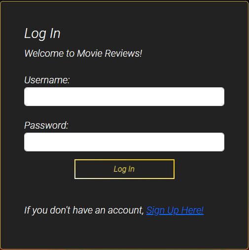

### Logout
 - The form enables the user to logout of their account.
 - An alert that the user has logged out will be displayed on the screen.
 

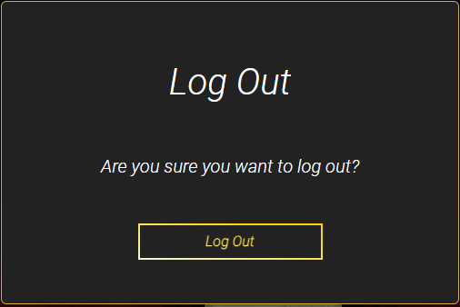

### Index Page
 - The welcome at the top greets the user & gives small explanation.
 - The cards are responsive on all screens.
 - there will be 8 cards per page. If 9 cards are made, a "Next page" button will appear at the bottom center of the page so users can continue on to the next page to see other reviews.  
 

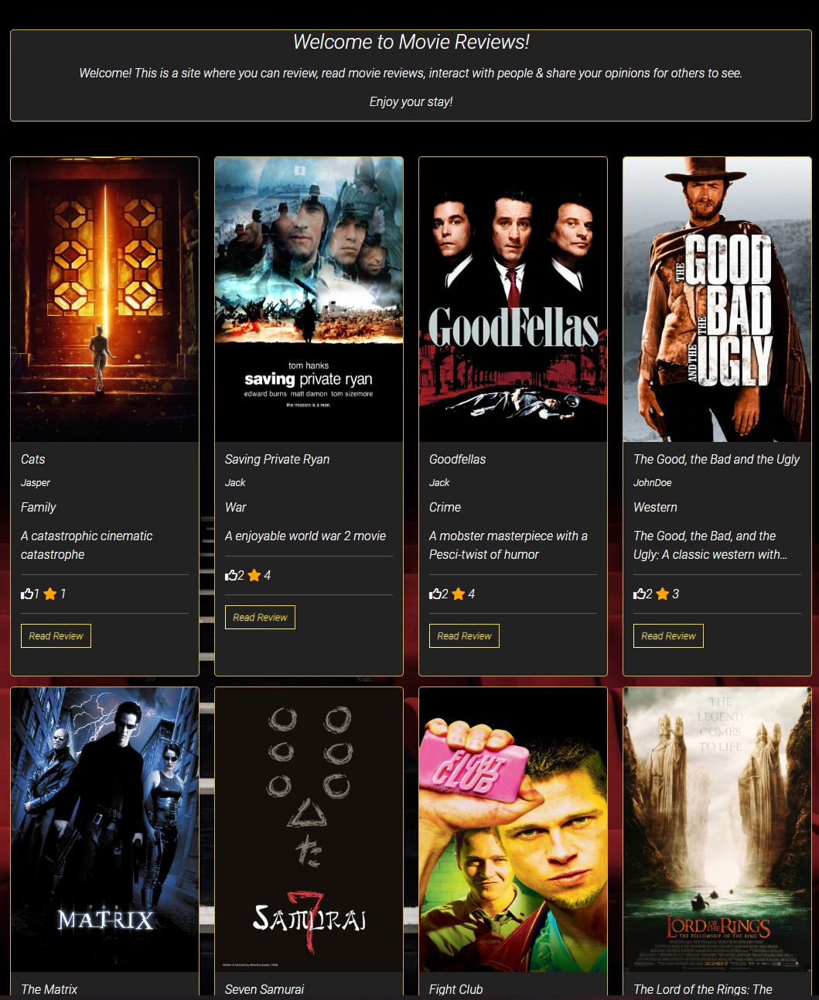

### Review Card
 - The cards show:
    - Image
    - Title
    - Author
    - Genre
    - Excerpt (if to long, it will end with ... after 2 rows going to it's third.)
    - Like & Rating
    - The button
 - The button will lead the user to the full review
 

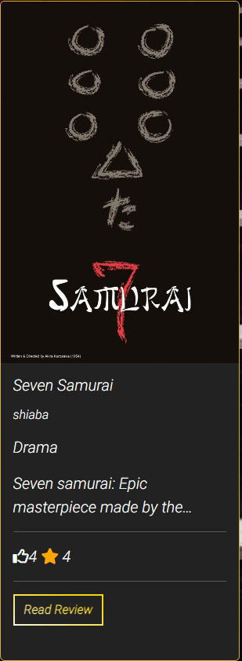

### Next Page Button
 - The next page will lead the user to other reviews & the "Previous page" button will lead the user back to previous page.
 

### Review Detail Page
 - The Review detail page remains responsive on all screen sizes
 - The Review detail shows:
   - Title at the top
   - Image is to the left. If no image has been added, there will be a default image added.
   - Below image is the full excerpt, so that it can be read if users wish to.
   - At the right side is Author
   - Created date
   - Genre
   - Rating
   - Review
 

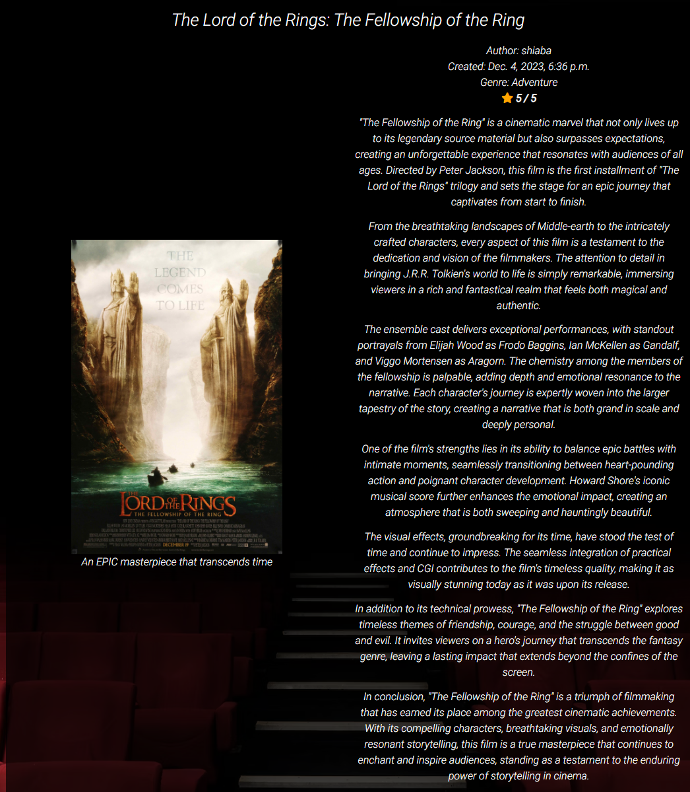

### Edit & Delete Buttons
 - The creator of the review must be logged in for them to be able to see these buttons.
 - If the edit button is pressed, the user will be redirected to the edit page.
 - If the delete button is pressed, the user will be redirected to the delete page.
 

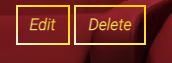

### Like & Comment Counter
 - Users will see the counters like normal but cant like anything unless logged in. 
 - If the user presses the like button, the hand will change color to black & the like will add +1 to the counter. If pressed again, the counter will go down -1 or until 0 & the color will revert back to white.
 - Comment counter will only go up in number if comments have been written & approved by admin.
 
 

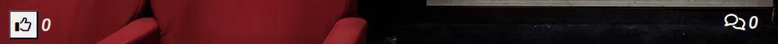

### Leave Comment Section
 - Only users can leave comments on reviews.
 - If not logged in, leave comment section will not be visible.
 

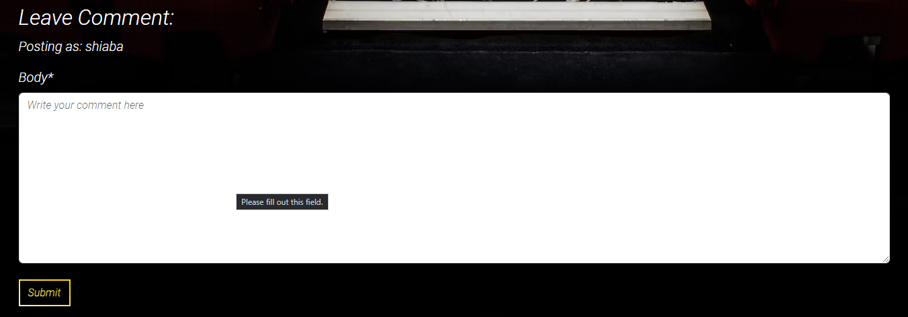

### Comment Section
 - Comment section can be seen by any user(logged in or not) of the site.
 - Admin will have to approve any comment made.
 - Comment section shows
   - Name
   - Date/time created
   - Comment
 

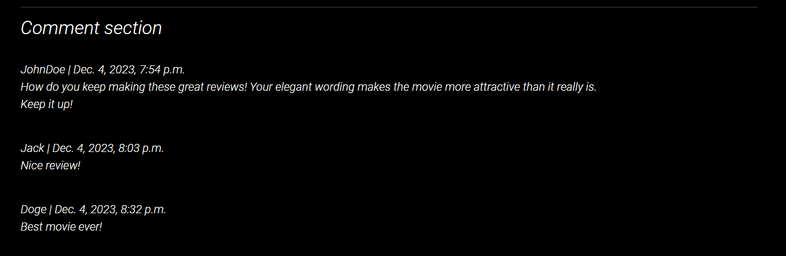

### Update Page
 - User needs to be the author & be logged in to make any changes.
 - Here users can update their reviews if they've made any mistakes or changed their mind since the review was made.
 - All the content that was added & saved during the create review page will be saved when pressing the edit button. 
 

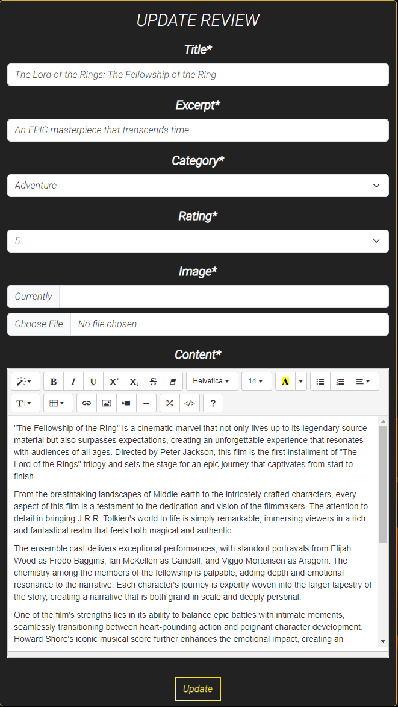

### Delete Page
 - User needs to be the author & be logged in to delete their own review. 
 - User can delete their review if pressing the "Delete Review button".
 - If user deletes their review, all likes & comments will also be removed that was made on users specific review.
 

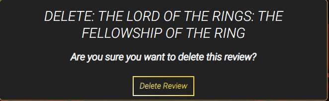

## Features yet to add

- User can have the possibility to change password, delete their account or add image to profile.
- User can search for a specific movie name.
- Add contact page so that people can contact us if they have any questions.
- Add reset password & forgot password buttons.
- Add possibility to edit user name & delete user too.
- Add possibility for the user to edit &/or delete their comments.
- Possibility to add several genres, rather than just the one that is possible right now.
- Possibility to like/unlike comments made.

[Back to top](#contents)

## Wireframes
I created the flowchart on [wireframe.cc](https://wireframe.cc/), then printed the creation instead of saving it.

- [Wireframe](/images/wireframe/main-page.png)
- [Wireframe](/images/wireframe/review-page.png)
- [Wireframe](/images/wireframe/sign-in.png)
- [Wireframe](/images/wireframe/sign-out.png)
- [Wireframe](/images/wireframe/sign-up.png)

[Back to top](#contents)

# User Experience

## Agile

This project was designed using Agile methodology, utilising the Kanban Board in GitHub.

- [Kanban Board](https://github.com/users/Shiaba/projects/2)

## User Stories

### User Expectations
- To be able to navigate through the site.
- To understand what the site is about.
- Create an account & be able to read, create movie reviews, like &/or interact with other users through comment section.
- Functions & links works as expected.
- Feedback through alerts or messages when interacting with certain functions.
- Have a responsive site work on all kinds of devices.

[Back to top](#contents)

# Technologies Used

- [Github](https://github.com/)
 
Used to store data & host for projects.

- [Codeanywhere](https://app.codeanywhere.com/)
 
Used to build project.

- [Cloudinary](https://cloudinary.com/)
 
Cloud platform used to store static media files.

- [Heroku](https://id.heroku.com/login)
 
Heroku is a cloud platform, used to deploy projects to live site.

- [ElephantSQL](https://www.elephantsql.com/)
 
Used to store PostgreSQL database.

## Libraries, Frameworks & Programming Languages Used

- [HTML](https://developer.mozilla.org/en-US/docs/Web/HTML)
- [Python](https://www.python.org/)
- [CSS](https://developer.mozilla.org/en-US/docs/Web/CSS)
- [Django 4.2.7](https://docs.djangoproject.com/en/4.2/releases/4.0/)
- [Django Allauth](https://docs.allauth.org/en/latest/)
- [Django Summernote](<https://summernote.org/>)
- [Django Crispy Forms](<https://django-crispy-forms.readthedocs.io/en/latest/#>)
- [Crispy Bootstrap 5](<https://pypi.org/project/crispy-bootstrap5/>)
- [Psycopg2](<https://pypi.org/project/psycopg2/>)
- [Gunicorn](<https://docs.djangoproject.com/en/3.2/howto/deployment/wsgi/gunicorn/>)
- [Whitenoise](https://whitenoise.readthedocs.io/en/latest/)

[Back to top](#contents)

# Testing
- I tested the page responsiveness on Firefox, Chrome, Brave & Microsoft edge.

## Manual testing

### Signup, Login & Logout
| TEST | OUTCOME | PASS/FAIL|
|:---:|:---:|:---:|
| Create account | Created successfully | Pass |
| Login | Login successful | Pass |
| Logout | Logout successful | Pass |

### Base (navbar, footer)
| TEST | OUTCOME | PASS/FAIL|
|:---:|:---:|:---:|
| "Movie Reviews" available for all users when clicked on |  User will be directed to the main page | Pass |
| Non logged-in users click "Sign up" button to arrive to sign up page |  User will be directed to the sign up page | Pass |
| Type in information to sign up | User will get signed up & get an success alert if correctly writing all the required information | Pass |
| Non logged-in users click "Log in" button to arrive to log in page | User will be directed to the log in page | Pass |
| Type in previously successful sign up made by user to log in | User will get logged in & get an alert that they've logged in  | Pass |
| Only logged-in users can see & click "Review Moview"(create review) in order to get to the page | User will be directed to "Review Moview" as intended | Pass |
| Logged-in users click "Logout" button to arrive to Logout page | Users will be directed to the logout page | Pass |
| Log out as a logged-in user | User will get logged out & get an success alert that they've been logged out | Pass |
| Footer Link to Facebook icon | Facebook page opens in a new tab | Pass |
| Footer Link to Instagram icon | Intagram page opens in a new tab | Pass |
| Footer Link to Twitter icon | Twitter page opens in a new tab | Pass |
| Footer Link to Youtube icon | Youtube page opens in a new tab | Pass |

### Index (review cards page)
| TEST | OUTCOME | PASS/FAIL|
|:---:|:---:|:---:|
| Click on "Read Review" to get to review detail page in order to read the whole review | User will be directed to review detail page as intended | Pass |
| User presses "Next page" to get to next page to see what movie review cards is on this page (If there are more than 8 reviews)  | User will be directed to next page as intended | Pass |
| User presses "Previous page" to get back to previous page | User will be directed to previous page as intended | Pass |

### Review detail page
| TEST | OUTCOME | PASS/FAIL|
|:---:|:---:|:---:|
| All information about the review will be visible for all users | The Title, Date, Genre, Rating, Excerpt, Image, Content (review), Comment section, Like & comment counter will be visible as intended | Pass |
| Logged-in users press like button in order to like a review | The like counter will successfully increase by 1 & the hand will change color to black in order to highlight that a change has been made | Pass |
| Logged-in users who have previously liked a post presses the button in order to unlike it | If pressed again, the counter will go down with 1 like & the color will revert back to white in order to highlight that it's been unliked | Pass |
| Logged-in users press the edit button for their own review(The button will only show it's the authors) in order to land in the edit page | The user/Author will be directed to the Update page where they can make small or large changes or none at all | Pass |
| Logged-in users press the delete button for their own review(The button will only show it's the authors) in order to land in the delete page | The user/Author will be directed to the delete page where they can delete their own review & all comments & likes(From that specific review) with it | Pass |
| Logged-in users writes a comment & presses the submit button in order to get it to be seen in the comment section | If the comment is approved by the admin, the comment will be posted & seen at the comment section as intended | Pass |

### Create page
| TEST | OUTCOME | PASS/FAIL|
|:---:|:---:|:---:|
| Logged-in user doesn't write the review correctly | User will get get warnings about the required parts that must be written | Pass |
| Logged-in user writes all the review correctly except the content part where they only press space & submit the review | The content requires something to be typed into it, however, it does not recognize the difference between a space press or text | Fail |
| Logged-in user writes a review correctly & presses submit in order to get their review posted in the home page | The review will appear at the top of the page if it is the newest review | Pass |

 

## Validator testing

### CI Python Linter:
- Admin.py: All  clear, no errors found
- Models.py: All  clear, no errors found
- Forms.py: All  clear, no errors found 
- Views.py: All  clear, no errors found 
- Urls.py: All  clear, no errors found
- Settings.py: 
  - 38: E501 line too long (88 > 79 characters)
  - 137: E501 line too long (91 > 79 characters)
  - 140: E501 line too long (81 > 79 characters)
  - 143: E501 line too long (82 > 79 characters)
  - 146: E501 line too long (83 > 79 characters)
  - 169: E501 line too long (80 > 79 characters)

### Python syntax checker
- I got the exact same result on all the tests with Python syntax checker. I tested on all the same sites as I did on CI Python Linter 
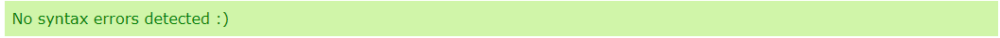

### W3C Jigsaw (CSS) 
 [W3C Jigsaw](./docs/validator/css.png)

### W3C Validator (HTML)
- I noticed that a lot of the issues(I checked & found no issues) were from base.html or  creating errors.
 [Base](./docs/validator/w3c-base.png)
 [Create Review](./docs/validator/w3c-create-review.png)
 [Delete Review](./docs/validator/w3c-delete-review.png)
 [Index](./docs/validator/w3c-index.png)
 [Login](./docs/validator/w3c-login.png)
 [Logout](./docs/validator/w3c-logout.png)
 [Review Detail](./docs/validator/w3c-review-detail.png)
 [Signup](./docs/validator/w3c-signup.png)
 [Update Review](./docs/validator/w3c-update-review.png)

### Accessibility
 
 - [Mobile Index](./docs/lighthouse/mobile-index.png)
 - [Desktop Index](./docs/lighthouse/desktop-index.png)
 - [Mobile Review Detail](./docs/lighthouse/mobile-review-detail.png)
 - [Desktop Review Detail](./docs/lighthouse/desktop-review-detail.png)
 - [Mobile Create Review](./docs/lighthouse/mobile-create-review.png)
 - [Desktop Create Review](./docs/lighthouse/desktop-create-review.png)
 - [Mobile Delete Review](./docs/lighthouse/mobile-delete-review.png)
 - [Desktop Delete Review](./docs/lighthouse/desktop-delete-review.png)
 - [Mobile Update Review](./docs/lighthouse/mobile-update-review.png)
 - [Desktop Update Review](./docs/lighthouse/desktop-update-review.png)
 - [Mobile Login](./docs/lighthouse/mobile-login.png)
 - [Desktop Login](./docs/lighthouse/desktop-login.png)
 - [Mobile Logout](./docs/lighthouse/mobile-logout.png)
 - [Desktop Logout](./docs/lighthouse/desktop-logout.png)
 - [Mobile Signup](./docs/lighthouse/mobile-signup.png)
 - [Desktop Signup](./docs/lighthouse/desktop-signup.png)

[Back to top](#contents)

# Bug Encounters

## Solved
- I had issues with  & loading in bootstrap & css. I solved it by installing whitenoise & add import path from urls.py.

- I had issues with pushing the footer to the bottom screen. I had to add flex with min-height of 100vh to .page on css to solve the issue.

- During the project, I had an issue with logging in to my admin site. I had to add ‘CSRF_TRUSTED_ORIGINS’ in settings to fix the issue. 

- I had an issue connecting the url for create_review. The issue was solved by changing a previous path from path(‘<slug:slug>/’) to path(‘review_detail/<slug:slug>/’). As soon as that name was changed, the connection issue was solved.

## Unsolved and scrapped features:
- I Couldn’t get the blankspace issue resolved when user comments with sending only a empty space comment. The User will recieve a alert that the "Your comment is awaiting approval". However, after the comment was sent, there is nothing sent to the admin site since the comment was empty.

- I get Instance of ‘ManyToManyField’ has no ‘count’ member – pylint(no-member) from models.py
- I also get 3 warnings of “Class ‘Review’ has no ‘objects’ member – pylint(no-member)” from views.py

[Back to top](#contents)

# Deployment
### Github
- Create project on Github by clicking the green "Create a new repository" button & write your project name.

### ElephantSQL
- Navigate to ElephantSQL.com and create a new account or log in with your Github account.
- Click "Create new instance" button (at the top, middle of the screen is a dropdown menu).
- Add name, plan (Tiny Turtle (Free)).
- Select region button (Region closest to you).
- Click "Review", if all is correct, click “Create instance”.
- Return to your dashboard, click "DETAILS" (on the left hand side) & copy the "URL".

### Cloudinary
- Create a Cloudinary account
- Copy API Environment variable in the Cloudinary dashboard from the programmable media button to the left (it's a purple/blue-ish color just under the cloudinary icon).

### Heroku
- Create a Heroku account.
- Create a new Heroku app.
- Name app name & choose region.
- Go to settings, add:
    - KEY: Cloudinary_URL, VALUE(Your cloudinary url)
    - KEY: Database_URL, VALUE(Your Postgres url)
    - KEY: PORT, VALUE: 8000
 
- On deployment method, github is chosen.
- Search repository name.

- Choose manual deploy & if wanted "Enable Automatic Deploys", which keeps the project up to date through your Github repository.
- When successful, you can press the "Open app" button to open your page.

[Back to top](#contents)

# Credits

- The social media icons on the footer is from [Font awasesome](https://fontawesome.com/), All 4 social media icons:
[Youtube](https://fontawesome.com/icons/youtube?f=brands&s=solid), [Instagram](https://fontawesome.com/icons/instagram?f=brands&s=solid), [Twitter](https://fontawesome.com/icons/twitter?f=brands&s=solid), [Facebook](https://fontawesome.com/icons/facebook?f=brands&s=solid)

- I got my film favicon from: [Icons8](https://icons8.com/icons/set/film)

- I got my secret key for env.py codes from: [Randomkeygen](https://randomkeygen.com/)

- I used bootstrap v.5.3 to build my pages: [Bootstrap](https://getbootstrap.com/)

- I used chatGPT to write my reviews (8 reviews):
[ChatGPT](https://chat.openai.com/c/10d17526-3bbf-480f-85d6-fe4b753503fd)

- I added code from this page in to settings in order to change width for summernote:
[Link here](https://stackoverflow.com/questions/61657061/how-do-i-resize-the-width-of-summernote)

- To get the delete review alert, I checked out this site to get it working:
[Link here](https://stackoverflow.com/questions/24822509/success-message-in-deleteview-not-shown)

- I got the  cinema image from unsplashed:
[Link here](https://unsplash.com/photos/red-cinema-chair-evlkOfkQ5rE )

- I got the image as a placeholder if no other image was inserted or if added one broke down:
[Link here](https://unsplash.com/photos/the-walking-dead-dvd-movie-wMkaMXTJjlQ)

- I added all of the review images that’s been added from wallpapercave for my reviews:
[Link here](https://wallpapercave.com/)

- For the login to look more presentable I looked up how to add the label tags & remove {{ form.as_p }}:
[Link here](https://stackoverflow.com/questions/63020369/change-login-label-in-django-auth-form )

- I used the first answer in this page for the create_review page to post:
[Link here](https://stackoverflow.com/questions/55556165/setting-model-user-to-request-user-with-createview-in-django-returns-null-value)

- I got message alerts from here:
[Link here](https://docs.djangoproject.com/en/4.2/ref/contrib/messages/),
and the answer how to add it from here (second answer with 5 upvotes):
[Link here](https://stackoverflow.com/questions/24914637/show-a-successful-message-with-class-based-views)

- I got the  code that's in review_detail (row 73) from this video (from 6:25 min):
[Link here](https://www.youtube.com/watch?v=Y1Us5jVT07E)

- I got the card bootstrap & style for my index page from & had to make some changes to fix responsive issues. The CSS code that was copied & hade some changes made to is on row 31-49 & 158-163 on style.py:
[Link here](https://freefrontend.com/bootstrap-cards/). Here is the specific page:
[Link here](https://codepen.io/nikki-peel/pen/RwavQer)

## Code inspiration:

- In order to do things correctly, I've followed the "I Think Therefore I Blog" very carefully.
[Link here](https://learn.codeinstitute.net/courses/course-v1:CodeInstitute+FST101+2021_T1/courseware/b31493372e764469823578613d11036b/fe4299adcd6743328183aab4e7ec5d13/)

- Credits to my mentor who gave me a lot of helpful advice.
- Credits to tutor assistance who helped solve several technical issues that I had during the project.
- I checked these videos if I ever encountered an issue that I couldn’t solve.
[Link here](https://www.youtube.com/watch?v=B40bteAMM_M&list=PLCC34OHNcOtr025c1kHSPrnP18YPB-NFi) 

[Back to top](#contents)
